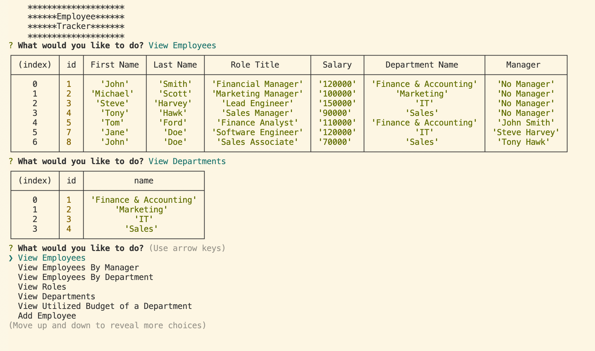

# 12 SQL: Employee Tracker   

<p align="center">
    
    
    
    
</p>
  
<p align="center">
    
    
    
    
    
    
    

</p>
   
## Description
  
🔍 A node.js app that allows you to track all employees in a database, whilst also using inquirer to prompt the user of anything they want shown or any updates to be made. Including departments and roles within the company.
  
💻 Below is a screenshot showing the functionality of the application:
  


  
🎥 The full movie file showing functionality of the application can be found [here](https://drive.google.com/file/d/1fjZLEhlGIp_D6WgxEN2zV_JL5cfjQZnE/view)
  
## User Story
  
```
AS A business owner
I WANT to be able to view and manage the departments, roles, and employees in my company
SO THAT I can organize and plan my business
```
  
## Table of Contents
- [Installation](#installation)
- [Usage](#usage)
- [Contributing](#contributing)
- [Contact](#contact)

## Installation
💾 Run the following commands to install this application
  
`npm init`
  
`npm i inquirer mysql2 sequelize dotenv console.table`
  
## Usage
💻 Run the following command at the root of your project and answer the prompted questions:
  
`node index.js` 

## Contributing
[Marissa Krantz](https://github.com/marissakrantz)

## Contact
✉️ Contact me with any questions: [email](mailto:marissaleak@hotmail.com) , [GitHub](https://github.com/marissakrantz)<br />
